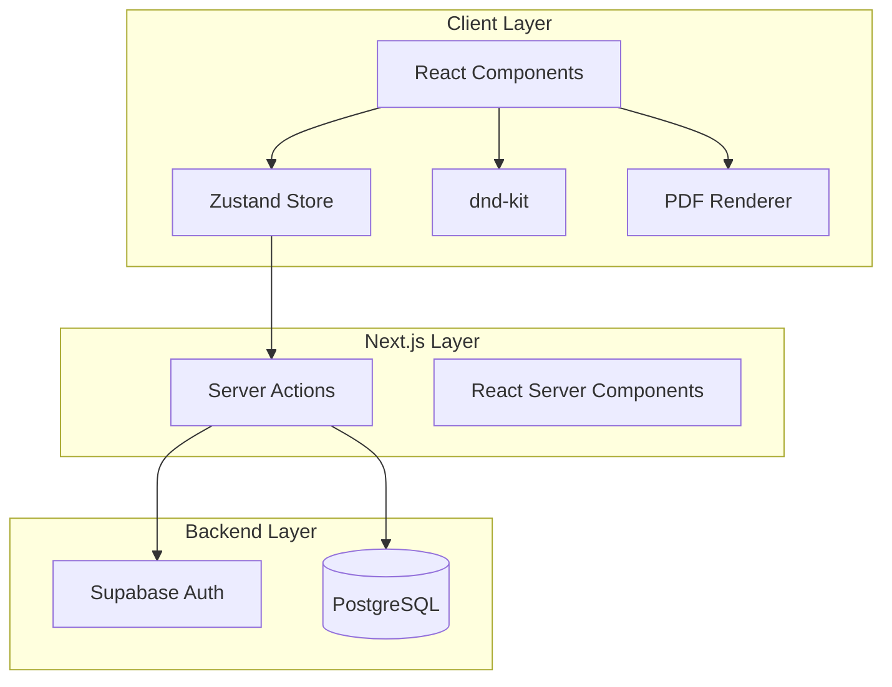
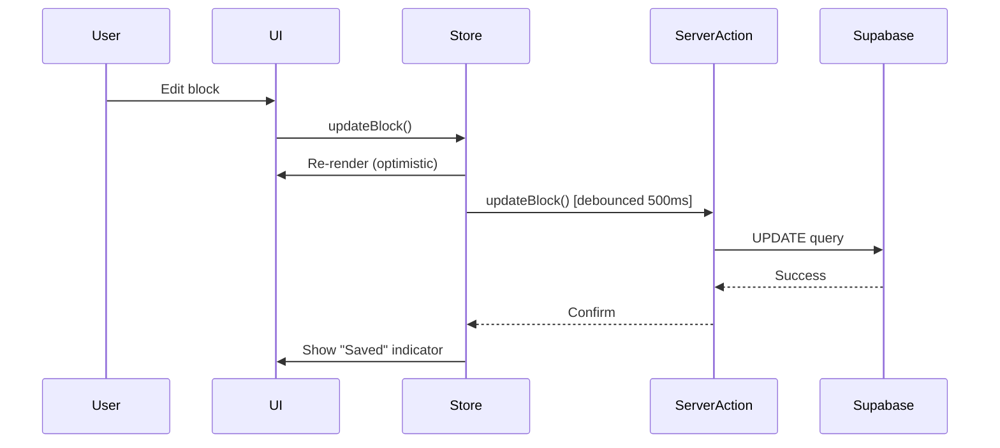

# Design Document: Address Book PDF Layout Builder

## Overview

The Address Book PDF Layout Builder is a Next.js 16 web application that provides a split-screen interface for creating and exporting printable address book PDFs. The application uses a modern React architecture with server-side rendering, Supabase for backend services, and a component-based design pattern.

### Key Design Principles

1. **Separation of Concerns**: Clear boundaries between UI components, state management, data persistence, and PDF generation
2. **Real-time Synchronization**: Immediate visual feedback with optimistic updates and background persistence
3. **Print-First Design**: Layout canvas exactly matches PDF output for WYSIWYG experience
4. **Performance**: Optimized rendering with React.memo, debounced saves, and lazy loading
5. **Type Safety**: Full TypeScript coverage with Zod runtime validation

### Technology Stack

- **Framework**: Next.js 16 with App Router and React Server Components
- **Language**: TypeScript 5
- **Styling**: Tailwind CSS 4 with shadcn/ui components
- **State Management**: Zustand for client-side state
- **Backend**: Supabase (PostgreSQL, Auth)
- **Forms**: React Hook Form with Zod validation
- **Drag & Drop**: dnd-kit library
- **PDF Generation**: react-pdf (@react-pdf/renderer)
- **Testing**: Vitest with fast-check for property-based testing

## Architecture

### High-Level Architecture



### Application Flow

1. **Authentication Flow**: User authenticates via Supabase Auth → Session established → User redirected to editor
2. **Data Loading Flow**: RSC fetches user's blocks from Supabase → Hydrates Zustand store → Renders UI
3. **Edit Flow**: User modifies block → Store updates → Optimistic UI update → Debounced server action → Supabase persistence
4. **Drag Flow**: User drags block → dnd-kit handles interaction → Store updates position → Server action persists
5. **Export Flow**: User clicks export → PDF renderer reads store → Generates PDF document → Browser download

### Layer Responsibilities

**Client Layer**:
- Render UI components with Tailwind CSS and shadcn/ui
- Handle user interactions (clicks, drags, keyboard)
- Manage local state with Zustand
- Optimistic updates for immediate feedback

**Next.js Layer**:
- Server actions for database mutations
- Server components for initial data fetching
- API routes for PDF generation (if needed)
- Middleware for authentication checks

**Backend Layer**:
- PostgreSQL database for persistent storage
- Supabase Auth for user management
- User-based data filtering in server actions
- Automatic timestamp management

## Components and Interfaces

### Component Hierarchy

```
App Layout (RSC)
├── AuthProvider
└── EditorPage (RSC)
    ├── EditorLayout
    │   ├── BlockEditor (Client)
    │   │   ├── NameInputArray
    │   │   ├── AddressTextarea
    │   │   ├── MobileInput
    │   │   └── ActionButtons
    │   └── LayoutCanvas (Client)
    │       ├── PageContainer
    │       │   └── AddressBlock (Draggable)
    │       ├── GridOverlay
    │       └── ZoomControls
    ├── Toolbar (Client)
    │   ├── UndoRedoButtons
    │   ├── AddBlockButton
    │   └── ExportPDFButton
    └── PageNavigator (Client)
        └── PageThumbnail[]
```


### Core Components

#### EditorLayout Component
- **Type**: Client Component
- **Purpose**: Split-screen container with resizable panels
- **Props**: `initialBlocks: AddressBlock[]`
- **State**: Panel sizes, responsive breakpoints
- **Responsibilities**: Layout management, responsive behavior

#### BlockEditor Component
- **Type**: Client Component
- **Purpose**: Form for editing selected address block
- **Props**: `selectedBlockId: string | null`
- **State**: Form state via React Hook Form
- **Key Features**:
  - Dynamic name array with add/remove buttons
  - Zod validation with inline error messages
  - Autosave with debounce (500ms)
  - Save/Delete/Duplicate actions

#### LayoutCanvas Component
- **Type**: Client Component
- **Purpose**: Visual preview of address book layout
- **Props**: `blocks: AddressBlock[]`, `selectedBlockId: string | null`, `zoomLevel: number`
- **State**: Drag state, scroll position
- **Key Features**:
  - Multi-page vertical scroll
  - Grid overlay (toggleable)
  - Snap-to-grid during drag
  - Click selection
  - Real-time updates

#### AddressBlock Component
- **Type**: Client Component
- **Purpose**: Draggable/resizable block displaying contact info
- **Props**: `block: AddressBlock`, `isSelected: boolean`, `gridUnit: number`
- **Key Features**:
  - dnd-kit draggable wrapper
  - Corner resize handles
  - Selection highlighting
  - Print-friendly styling (white bg, grey borders)


#### PageNavigator Component
- **Type**: Client Component
- **Purpose**: Sidebar showing page thumbnails
- **Props**: `pages: number[]`, `currentPage: number`
- **Key Features**:
  - Thumbnail previews
  - Click to scroll to page
  - Add page button
  - Page number indicators

#### PDFDocument Component
- **Type**: react-pdf Document
- **Purpose**: PDF generation template
- **Props**: `blocks: AddressBlock[]`, `gridConfig: GridConfig`
- **Key Features**:
  - A4 page dimensions
  - Print margins
  - Exact styling match with canvas
  - Multi-page support

### Server Actions

```typescript
// app/actions/blocks.ts

export async function createBlock(data: CreateBlockInput): Promise<AddressBlock>
export async function updateBlock(id: string, data: UpdateBlockInput): Promise<AddressBlock>
export async function deleteBlock(id: string): Promise<void>
export async function getBlocks(userId: string): Promise<AddressBlock[]>
export async function duplicateBlock(id: string): Promise<AddressBlock>
```

### Custom Hooks

```typescript
// hooks/useBlockStore.ts
export function useBlockStore(): BlockStore

// hooks/useAutosave.ts
export function useAutosave(block: AddressBlock, delay: number): void

// hooks/useKeyboardShortcuts.ts
export function useKeyboardShortcuts(): void

// hooks/useDragAndDrop.ts
export function useDragAndDrop(): DragHandlers

// hooks/useUndoRedo.ts
export function useUndoRedo(): { undo: () => void; redo: () => void; canUndo: boolean; canRedo: boolean }
```

## Data Models

### TypeScript Interfaces

```typescript
// types/block.ts

export interface AddressBlock {
  id: string;
  names: string[];
  address: string;
  mobile: string;
  x: number;
  y: number;
  width: number;
  height: number;
  page_number: number;
  created_at: string;
  updated_at: string;
  user_id: string;
}

export interface GridConfig {
  columns: number;
  rows: number;
  unitWidth: number;
  unitHeight: number;
  pageWidth: number;
  pageHeight: number;
  margin: number;
}

export interface BlockStore {
  blocks: AddressBlock[];
  selectedBlockId: string | null;
  currentPage: number;
  zoomLevel: number;
  history: AddressBlock[][];
  historyIndex: number;
  
  // Actions
  setBlocks: (blocks: AddressBlock[]) => void;
  addBlock: (block: AddressBlock) => void;
  updateBlock: (id: string, updates: Partial<AddressBlock>) => void;
  deleteBlock: (id: string) => void;
  selectBlock: (id: string | null) => void;
  setCurrentPage: (page: number) => void;
  setZoomLevel: (level: number) => void;
  undo: () => void;
  redo: () => void;
}
```


### Zod Schemas

```typescript
// schemas/block.ts

import { z } from 'zod';

export const nameSchema = z.string().min(1, 'Name is required').max(100, 'Name too long');

export const addressBlockSchema = z.object({
  names: z.array(nameSchema).min(1, 'At least one name is required'),
  address: z.string().max(500, 'Address too long'),
  mobile: z.string().regex(/^[0-9\s\-()]+$/, 'Invalid mobile number format').optional().or(z.literal('')),
  x: z.number().int().min(0),
  y: z.number().int().min(0),
  width: z.number().int().min(1),
  height: z.number().int().min(1),
  page_number: z.number().int().min(1),
});

export const createBlockSchema = addressBlockSchema;
export const updateBlockSchema = addressBlockSchema.partial();

export type CreateBlockInput = z.infer<typeof createBlockSchema>;
export type UpdateBlockInput = z.infer<typeof updateBlockSchema>;
```

### Database Schema

```sql
-- Supabase migration

CREATE TABLE address_blocks (
  id UUID PRIMARY KEY DEFAULT gen_random_uuid(),
  names TEXT[] NOT NULL,
  address TEXT NOT NULL DEFAULT '',
  mobile TEXT NOT NULL DEFAULT '',
  x INTEGER NOT NULL DEFAULT 0,
  y INTEGER NOT NULL DEFAULT 0,
  width INTEGER NOT NULL DEFAULT 1,
  height INTEGER NOT NULL DEFAULT 1,
  page_number INTEGER NOT NULL DEFAULT 1,
  created_at TIMESTAMPTZ NOT NULL DEFAULT NOW(),
  updated_at TIMESTAMPTZ NOT NULL DEFAULT NOW(),
  user_id UUID NOT NULL REFERENCES auth.users(id) ON DELETE CASCADE,
  
  CONSTRAINT names_not_empty CHECK (array_length(names, 1) > 0),
  CONSTRAINT positive_dimensions CHECK (width > 0 AND height > 0),
  CONSTRAINT positive_position CHECK (x >= 0 AND y >= 0),
  CONSTRAINT positive_page CHECK (page_number > 0)
);

-- Indexes
CREATE INDEX idx_address_blocks_user_id ON address_blocks(user_id);
CREATE INDEX idx_address_blocks_page_number ON address_blocks(page_number);

-- Updated_at trigger
CREATE OR REPLACE FUNCTION update_updated_at_column()
RETURNS TRIGGER AS $$
BEGIN
  NEW.updated_at = NOW();
  RETURN NEW;
END;
$$ LANGUAGE plpgsql;

CREATE TRIGGER update_address_blocks_updated_at
  BEFORE UPDATE ON address_blocks
  FOR EACH ROW
  EXECUTE FUNCTION update_updated_at_column();
```


## State Management Design

### Zustand Store Implementation

```typescript
// store/blockStore.ts

import { create } from 'zustand';
import { AddressBlock } from '@/types/block';

const MAX_HISTORY = 50;

interface BlockStore {
  blocks: AddressBlock[];
  selectedBlockId: string | null;
  currentPage: number;
  zoomLevel: number;
  history: AddressBlock[][];
  historyIndex: number;
  
  setBlocks: (blocks: AddressBlock[]) => void;
  addBlock: (block: AddressBlock) => void;
  updateBlock: (id: string, updates: Partial<AddressBlock>) => void;
  deleteBlock: (id: string) => void;
  selectBlock: (id: string | null) => void;
  setCurrentPage: (page: number) => void;
  setZoomLevel: (level: number) => void;
  undo: () => void;
  redo: () => void;
  pushHistory: () => void;
}

export const useBlockStore = create<BlockStore>((set, get) => ({
  blocks: [],
  selectedBlockId: null,
  currentPage: 1,
  zoomLevel: 1,
  history: [],
  historyIndex: -1,
  
  setBlocks: (blocks) => set({ blocks }),
  
  addBlock: (block) => {
    get().pushHistory();
    set((state) => ({ blocks: [...state.blocks, block] }));
  },
  
  updateBlock: (id, updates) => {
    get().pushHistory();
    set((state) => ({
      blocks: state.blocks.map((b) => (b.id === id ? { ...b, ...updates } : b)),
    }));
  },
  
  deleteBlock: (id) => {
    get().pushHistory();
    set((state) => ({
      blocks: state.blocks.filter((b) => b.id !== id),
      selectedBlockId: state.selectedBlockId === id ? null : state.selectedBlockId,
    }));
  },
  
  selectBlock: (id) => set({ selectedBlockId: id }),
  setCurrentPage: (page) => set({ currentPage: page }),
  setZoomLevel: (level) => set({ zoomLevel: level }),
  
  undo: () => {
    const { history, historyIndex } = get();
    if (historyIndex > 0) {
      const newIndex = historyIndex - 1;
      set({ blocks: history[newIndex], historyIndex: newIndex });
    }
  },
  
  redo: () => {
    const { history, historyIndex } = get();
    if (historyIndex < history.length - 1) {
      const newIndex = historyIndex + 1;
      set({ blocks: history[newIndex], historyIndex: newIndex });
    }
  },
  
  pushHistory: () => {
    const { blocks, history, historyIndex } = get();
    const newHistory = history.slice(0, historyIndex + 1);
    newHistory.push(JSON.parse(JSON.stringify(blocks)));
    
    if (newHistory.length > MAX_HISTORY) {
      newHistory.shift();
    }
    
    set({ history: newHistory, historyIndex: newHistory.length - 1 });
  },
}));
```


### State Synchronization Strategy

1. **Optimistic Updates**: UI updates immediately when user makes changes
2. **Debounced Persistence**: Server actions called after 500ms of inactivity
3. **Conflict Resolution**: Last-write-wins strategy (acceptable for single-user editing)
4. **Error Recovery**: On save failure, retry up to 3 times, then show error toast

### State Flow Diagram



## API and Server Actions Design

### Server Actions Structure

```typescript
// app/actions/blocks.ts
'use server';

import { createClient } from '@/lib/supabase/server';
import { addressBlockSchema } from '@/schemas/block';
import { revalidatePath } from 'next/cache';

export async function getBlocks() {
  const supabase = await createClient();
  const { data: { user } } = await supabase.auth.getUser();
  
  if (!user) {
    throw new Error('Unauthorized');
  }
  
  const { data, error } = await supabase
    .from('address_blocks')
    .select('*')
    .eq('user_id', user.id)
    .order('page_number', { ascending: true })
    .order('y', { ascending: true })
    .order('x', { ascending: true });
  
  if (error) throw error;
  return data;
}

export async function createBlock(input: CreateBlockInput) {
  const supabase = await createClient();
  const { data: { user } } = await supabase.auth.getUser();
  
  if (!user) {
    throw new Error('Unauthorized');
  }
  
  const validated = addressBlockSchema.parse(input);
  
  const { data, error } = await supabase
    .from('address_blocks')
    .insert({ ...validated, user_id: user.id })
    .select()
    .single();
  
  if (error) throw error;
  
  revalidatePath('/editor');
  return data;
}

export async function updateBlock(id: string, input: UpdateBlockInput) {
  const supabase = await createClient();
  const { data: { user } } = await supabase.auth.getUser();
  
  if (!user) {
    throw new Error('Unauthorized');
  }
  
  const { data, error } = await supabase
    .from('address_blocks')
    .update(input)
    .eq('id', id)
    .eq('user_id', user.id)
    .select()
    .single();
  
  if (error) throw error;
  
  revalidatePath('/editor');
  return data;
}

export async function deleteBlock(id: string) {
  const supabase = await createClient();
  const { data: { user } } = await supabase.auth.getUser();
  
  if (!user) {
    throw new Error('Unauthorized');
  }
  
  const { error } = await supabase
    .from('address_blocks')
    .delete()
    .eq('id', id)
    .eq('user_id', user.id);
  
  if (error) throw error;
  
  revalidatePath('/editor');
}

export async function duplicateBlock(id: string) {
  const supabase = await createClient();
  const { data: { user } } = await supabase.auth.getUser();
  
  if (!user) {
    throw new Error('Unauthorized');
  }
  
  // Fetch original block
  const { data: original, error: fetchError } = await supabase
    .from('address_blocks')
    .select('*')
    .eq('id', id)
    .eq('user_id', user.id)
    .single();
  
  if (fetchError) throw fetchError;
  
  // Create duplicate with offset position
  const { data, error } = await supabase
    .from('address_blocks')
    .insert({
      names: original.names,
      address: original.address,
      mobile: original.mobile,
      x: original.x + 1,
      y: original.y + 1,
      width: original.width,
      height: original.height,
      page_number: original.page_number,
      user_id: user.id,
    })
    .select()
    .single();
  
  if (error) throw error;
  
  revalidatePath('/editor');
  return data;
}
```


### Supabase Client Configuration

```typescript
// lib/supabase/server.ts
import { createServerClient } from '@supabase/ssr';
import { cookies } from 'next/headers';

export async function createClient() {
  const cookieStore = await cookies();
  
  return createServerClient(
    process.env.NEXT_PUBLIC_SUPABASE_URL!,
    process.env.NEXT_PUBLIC_SUPABASE_ANON_KEY!,
    {
      cookies: {
        getAll() {
          return cookieStore.getAll();
        },
        setAll(cookiesToSet) {
          cookiesToSet.forEach(({ name, value, options }) =>
            cookieStore.set(name, value, options)
          );
        },
      },
    }
  );
}
```

```typescript
// lib/supabase/client.ts
import { createBrowserClient } from '@supabase/ssr';

export function createClient() {
  return createBrowserClient(
    process.env.NEXT_PUBLIC_SUPABASE_URL!,
    process.env.NEXT_PUBLIC_SUPABASE_ANON_KEY!
  );
}
```

## UI/UX Design Considerations

### Layout and Spacing

- **Split-screen ratio**: 40% editor, 60% canvas (resizable)
- **Grid configuration**: 3×3 default (9 blocks per page)
- **Grid unit size**: Calculated from A4 dimensions minus margins
- **Page margins**: 20mm on all sides for print safety
- **Component spacing**: Tailwind spacing scale (4px base unit)

### Color Palette (Print-Friendly White Theme)

```css
/* Primary colors */
--background: #ffffff;
--foreground: #1a1a1a;
--border: #e5e5e5;
--border-selected: #3b82f6;

/* Text colors */
--text-primary: #1a1a1a;
--text-secondary: #737373;
--text-muted: #a3a3a3;

/* Interactive elements */
--button-primary: #3b82f6;
--button-hover: #2563eb;
--button-danger: #ef4444;

/* Status indicators */
--success: #22c55e;
--error: #ef4444;
--warning: #f59e0b;
```

### Typography

- **Font family**: System font stack for performance
- **Block names**: 14px, font-weight: 600
- **Block address**: 12px, font-weight: 400
- **Block mobile**: 12px, font-weight: 400
- **UI labels**: 14px, font-weight: 500

### Interaction Patterns

1. **Block Selection**: Click block → Blue border + populate editor
2. **Drag and Drop**: Grab block → Visual feedback → Snap to grid → Drop
3. **Resize**: Hover corner → Resize cursor → Drag → Snap to grid units
4. **Keyboard Navigation**: Tab through form fields, arrow keys for block selection
5. **Autosave Indicator**: "Saving..." → "Saved" with fade-out animation


### Responsive Behavior

- **Desktop (>1024px)**: Full split-screen layout
- **Tablet (768-1024px)**: Vertical stack with collapsible editor
- **Mobile (<768px)**: Tab-based interface (Edit tab / Preview tab)

### Accessibility

- **Keyboard shortcuts**: All actions accessible via keyboard
- **ARIA labels**: Proper labeling for screen readers
- **Focus management**: Visible focus indicators, logical tab order
- **Color contrast**: WCAG AA compliance for all text
- **Error messages**: Associated with form fields via aria-describedby

## Technical Implementation Details

### Drag and Drop Implementation

```typescript
// hooks/useDragAndDrop.ts
import { useDndMonitor, DragEndEvent } from '@dnd-kit/core';
import { useBlockStore } from '@/store/blockStore';
import { updateBlock } from '@/app/actions/blocks';

export function useDragAndDrop(gridConfig: GridConfig) {
  const updateBlockInStore = useBlockStore((state) => state.updateBlock);
  
  useDndMonitor({
    onDragEnd: async (event: DragEndEvent) => {
      const { active, delta } = event;
      const blockId = active.id as string;
      
      // Calculate new position in grid units
      const deltaX = Math.round(delta.x / gridConfig.unitWidth);
      const deltaY = Math.round(delta.y / gridConfig.unitHeight);
      
      // Get current block
      const block = useBlockStore.getState().blocks.find((b) => b.id === blockId);
      if (!block) return;
      
      const newX = Math.max(0, block.x + deltaX);
      const newY = Math.max(0, block.y + deltaY);
      
      // Calculate page number based on Y position
      const newPage = Math.floor(newY / gridConfig.rows) + 1;
      const pageY = newY % gridConfig.rows;
      
      // Optimistic update
      updateBlockInStore(blockId, { 
        x: newX, 
        y: pageY, 
        page_number: newPage 
      });
      
      // Persist to database
      try {
        await updateBlock(blockId, { 
          x: newX, 
          y: pageY, 
          page_number: newPage 
        });
      } catch (error) {
        console.error('Failed to update block position:', error);
        // Revert optimistic update on error
      }
    },
  });
}
```

### Resize Implementation

```typescript
// hooks/useResize.ts
import { useState, useCallback } from 'react';
import { useBlockStore } from '@/store/blockStore';
import { updateBlock } from '@/app/actions/blocks';

export function useResize(blockId: string, gridConfig: GridConfig) {
  const [isResizing, setIsResizing] = useState(false);
  const updateBlockInStore = useBlockStore((state) => state.updateBlock);
  
  const handleResizeStart = useCallback(() => {
    setIsResizing(true);
  }, []);
  
  const handleResize = useCallback((deltaWidth: number, deltaHeight: number) => {
    const block = useBlockStore.getState().blocks.find((b) => b.id === blockId);
    if (!block) return;
    
    const newWidth = Math.max(1, block.width + Math.round(deltaWidth / gridConfig.unitWidth));
    const newHeight = Math.max(1, block.height + Math.round(deltaHeight / gridConfig.unitHeight));
    
    updateBlockInStore(blockId, { width: newWidth, height: newHeight });
  }, [blockId, gridConfig]);
  
  const handleResizeEnd = useCallback(async () => {
    setIsResizing(false);
    
    const block = useBlockStore.getState().blocks.find((b) => b.id === blockId);
    if (!block) return;
    
    try {
      await updateBlock(blockId, { 
        width: block.width, 
        height: block.height 
      });
    } catch (error) {
      console.error('Failed to update block size:', error);
    }
  }, [blockId]);
  
  return { isResizing, handleResizeStart, handleResize, handleResizeEnd };
}
```


### Autosave Implementation

```typescript
// hooks/useAutosave.ts
import { useEffect, useRef } from 'react';
import { updateBlock } from '@/app/actions/blocks';
import { AddressBlock } from '@/types/block';

export function useAutosave(block: AddressBlock | null, delay: number = 500) {
  const timeoutRef = useRef<NodeJS.Timeout>();
  const previousBlockRef = useRef<AddressBlock | null>(null);
  
  useEffect(() => {
    if (!block || !previousBlockRef.current) {
      previousBlockRef.current = block;
      return;
    }
    
    // Check if block has changed
    if (JSON.stringify(block) === JSON.stringify(previousBlockRef.current)) {
      return;
    }
    
    // Clear existing timeout
    if (timeoutRef.current) {
      clearTimeout(timeoutRef.current);
    }
    
    // Set new timeout
    timeoutRef.current = setTimeout(async () => {
      try {
        await updateBlock(block.id, {
          names: block.names,
          address: block.address,
          mobile: block.mobile,
        });
        previousBlockRef.current = block;
      } catch (error) {
        console.error('Autosave failed:', error);
      }
    }, delay);
    
    return () => {
      if (timeoutRef.current) {
        clearTimeout(timeoutRef.current);
      }
    };
  }, [block, delay]);
}
```

### Keyboard Shortcuts Implementation

```typescript
// hooks/useKeyboardShortcuts.ts
import { useEffect } from 'react';
import { useBlockStore } from '@/store/blockStore';
import { deleteBlock, duplicateBlock } from '@/app/actions/blocks';

export function useKeyboardShortcuts() {
  const { selectedBlockId, deleteBlock: deleteFromStore, addBlock, undo, redo } = useBlockStore();
  
  useEffect(() => {
    const handleKeyDown = async (e: KeyboardEvent) => {
      // Delete: Delete key
      if (e.key === 'Delete' && selectedBlockId) {
        e.preventDefault();
        deleteFromStore(selectedBlockId);
        await deleteBlock(selectedBlockId);
      }
      
      // Duplicate: Ctrl+D
      if (e.ctrlKey && e.key === 'd' && selectedBlockId) {
        e.preventDefault();
        const newBlock = await duplicateBlock(selectedBlockId);
        addBlock(newBlock);
      }
      
      // Undo: Ctrl+Z
      if (e.ctrlKey && e.key === 'z' && !e.shiftKey) {
        e.preventDefault();
        undo();
      }
      
      // Redo: Ctrl+Y or Ctrl+Shift+Z
      if ((e.ctrlKey && e.key === 'y') || (e.ctrlKey && e.shiftKey && e.key === 'z')) {
        e.preventDefault();
        redo();
      }
      
      // Deselect: Escape
      if (e.key === 'Escape') {
        e.preventDefault();
        useBlockStore.getState().selectBlock(null);
      }
    };
    
    window.addEventListener('keydown', handleKeyDown);
    return () => window.removeEventListener('keydown', handleKeyDown);
  }, [selectedBlockId, deleteFromStore, addBlock, undo, redo]);
}
```


### PDF Generation Implementation

```typescript
// components/PDFDocument.tsx
import { Document, Page, View, Text, StyleSheet } from '@react-pdf/renderer';
import { AddressBlock, GridConfig } from '@/types/block';

const styles = StyleSheet.create({
  page: {
    backgroundColor: '#ffffff',
    padding: '20mm',
  },
  block: {
    position: 'absolute',
    borderWidth: 1,
    borderColor: '#e5e5e5',
    borderStyle: 'solid',
    padding: 8,
  },
  name: {
    fontSize: 14,
    fontWeight: 600,
    color: '#1a1a1a',
    marginBottom: 4,
  },
  address: {
    fontSize: 12,
    color: '#1a1a1a',
    marginBottom: 4,
  },
  mobile: {
    fontSize: 12,
    color: '#1a1a1a',
  },
});

interface PDFDocumentProps {
  blocks: AddressBlock[];
  gridConfig: GridConfig;
}

export function PDFDocument({ blocks, gridConfig }: PDFDocumentProps) {
  // Group blocks by page
  const pageGroups = blocks.reduce((acc, block) => {
    if (!acc[block.page_number]) {
      acc[block.page_number] = [];
    }
    acc[block.page_number].push(block);
    return acc;
  }, {} as Record<number, AddressBlock[]>);
  
  const pageNumbers = Object.keys(pageGroups).map(Number).sort((a, b) => a - b);
  
  return (
    <Document>
      {pageNumbers.map((pageNum) => (
        <Page key={pageNum} size="A4" style={styles.page}>
          {pageGroups[pageNum].map((block) => (
            <View
              key={block.id}
              style={[
                styles.block,
                {
                  left: block.x * gridConfig.unitWidth,
                  top: block.y * gridConfig.unitHeight,
                  width: block.width * gridConfig.unitWidth,
                  height: block.height * gridConfig.unitHeight,
                },
              ]}
            >
              {block.names.map((name, idx) => (
                <Text key={idx} style={styles.name}>
                  {name}
                </Text>
              ))}
              <Text style={styles.address}>{block.address}</Text>
              {block.mobile && <Text style={styles.mobile}>{block.mobile}</Text>}
            </View>
          ))}
        </Page>
      ))}
    </Document>
  );
}
```

```typescript
// hooks/useExportPDF.ts
import { pdf } from '@react-pdf/renderer';
import { useBlockStore } from '@/store/blockStore';
import { PDFDocument } from '@/components/PDFDocument';
import { GridConfig } from '@/types/block';

export function useExportPDF(gridConfig: GridConfig) {
  const blocks = useBlockStore((state) => state.blocks);
  
  const exportPDF = async () => {
    try {
      const blob = await pdf(
        <PDFDocument blocks={blocks} gridConfig={gridConfig} />
      ).toBlob();
      
      const url = URL.createObjectURL(blob);
      const link = document.createElement('a');
      link.href = url;
      link.download = `address-book-${Date.now()}.pdf`;
      link.click();
      URL.revokeObjectURL(url);
    } catch (error) {
      console.error('PDF export failed:', error);
      throw error;
    }
  };
  
  return { exportPDF };
}
```

### Grid Configuration Calculation

```typescript
// lib/gridConfig.ts
import { GridConfig } from '@/types/block';

export function calculateGridConfig(): GridConfig {
  // A4 dimensions in points (1 point = 1/72 inch)
  const A4_WIDTH = 595.28;
  const A4_HEIGHT = 841.89;
  
  // Margins in points (20mm = ~56.69 points)
  const MARGIN = 56.69;
  
  // Usable area
  const usableWidth = A4_WIDTH - (MARGIN * 2);
  const usableHeight = A4_HEIGHT - (MARGIN * 2);
  
  // Default grid
  const COLUMNS = 3;
  const ROWS = 3;
  
  // Calculate unit dimensions
  const unitWidth = usableWidth / COLUMNS;
  const unitHeight = usableHeight / ROWS;
  
  return {
    columns: COLUMNS,
    rows: ROWS,
    unitWidth,
    unitHeight,
    pageWidth: A4_WIDTH,
    pageHeight: A4_HEIGHT,
    margin: MARGIN,
  };
}
```


### Performance Optimizations

```typescript
// components/AddressBlock.tsx (optimized)
import { memo } from 'react';
import { AddressBlock as AddressBlockType } from '@/types/block';

interface AddressBlockProps {
  block: AddressBlockType;
  isSelected: boolean;
  gridUnit: number;
  onSelect: (id: string) => void;
}

export const AddressBlock = memo(function AddressBlock({
  block,
  isSelected,
  gridUnit,
  onSelect,
}: AddressBlockProps) {
  return (
    <div
      onClick={() => onSelect(block.id)}
      className={`
        absolute border rounded p-2 cursor-pointer transition-colors
        ${isSelected ? 'border-blue-500 border-2' : 'border-gray-300'}
      `}
      style={{
        left: block.x * gridUnit,
        top: block.y * gridUnit,
        width: block.width * gridUnit,
        height: block.height * gridUnit,
      }}
    >
      {block.names.map((name, idx) => (
        <div key={idx} className="font-semibold text-sm">
          {name}
        </div>
      ))}
      <div className="text-xs mt-1">{block.address}</div>
      {block.mobile && <div className="text-xs">{block.mobile}</div>}
    </div>
  );
}, (prevProps, nextProps) => {
  // Custom comparison for memo
  return (
    prevProps.block.id === nextProps.block.id &&
    prevProps.isSelected === nextProps.isSelected &&
    prevProps.block.x === nextProps.block.x &&
    prevProps.block.y === nextProps.block.y &&
    prevProps.block.width === nextProps.block.width &&
    prevProps.block.height === nextProps.block.height &&
    JSON.stringify(prevProps.block.names) === JSON.stringify(nextProps.block.names) &&
    prevProps.block.address === nextProps.block.address &&
    prevProps.block.mobile === nextProps.block.mobile
  );
});
```

```typescript
// hooks/useVirtualization.ts (for large layouts)
import { useMemo } from 'react';
import { AddressBlock } from '@/types/block';

export function useVirtualization(
  blocks: AddressBlock[],
  currentPage: number,
  visiblePageRange: number = 2
) {
  const visibleBlocks = useMemo(() => {
    const minPage = Math.max(1, currentPage - visiblePageRange);
    const maxPage = currentPage + visiblePageRange;
    
    return blocks.filter(
      (block) => block.page_number >= minPage && block.page_number <= maxPage
    );
  }, [blocks, currentPage, visiblePageRange]);
  
  return visibleBlocks;
}
```

### Error Handling Strategy

```typescript
// lib/errorHandling.ts
import { toast } from 'sonner';

export class AppError extends Error {
  constructor(
    message: string,
    public code: string,
    public retryable: boolean = false
  ) {
    super(message);
    this.name = 'AppError';
  }
}

export async function withRetry<T>(
  fn: () => Promise<T>,
  maxRetries: number = 3,
  delay: number = 1000
): Promise<T> {
  let lastError: Error;
  
  for (let i = 0; i < maxRetries; i++) {
    try {
      return await fn();
    } catch (error) {
      lastError = error as Error;
      if (i < maxRetries - 1) {
        await new Promise((resolve) => setTimeout(resolve, delay * (i + 1)));
      }
    }
  }
  
  throw lastError!;
}

export function handleError(error: unknown, context: string) {
  console.error(`Error in ${context}:`, error);
  
  if (error instanceof AppError) {
    toast.error(error.message);
  } else if (error instanceof Error) {
    toast.error(`An error occurred: ${error.message}`);
  } else {
    toast.error('An unexpected error occurred');
  }
}
```

```typescript
// Example usage in server action
export async function updateBlock(id: string, input: UpdateBlockInput) {
  try {
    return await withRetry(async () => {
      const supabase = await createClient();
      const { data: { user } } = await supabase.auth.getUser();
      
      if (!user) {
        throw new AppError('You must be logged in', 'UNAUTHORIZED', false);
      }
      
      const { data, error } = await supabase
        .from('address_blocks')
        .update(input)
        .eq('id', id)
        .eq('user_id', user.id)
        .select()
        .single();
      
      if (error) {
        throw new AppError('Failed to update block', 'UPDATE_FAILED', true);
      }
      
      revalidatePath('/editor');
      return data;
    });
  } catch (error) {
    handleError(error, 'updateBlock');
    throw error;
  }
}
```


## Correctness Properties

*A property is a characteristic or behavior that should hold true across all valid executions of a system-essentially, a formal statement about what the system should do. Properties serve as the bridge between human-readable specifications and machine-verifiable correctness guarantees.*

### Property 1: User Data Isolation

*For any* authenticated user and any address block query, the system should only return blocks where the user_id matches the authenticated user's ID.

**Validates: Requirements 1.3, 18.2**

### Property 2: Names Array Modification

*For any* address block with a names array, adding a name should increase the array length by 1, and removing a name should decrease the array length by 1 and remove the correct entry.

**Validates: Requirements 2.3, 2.4**

### Property 3: Names Array Validation

*For any* address block with an empty names array, attempting to save should fail validation.

**Validates: Requirements 2.5, 15.2**

### Property 4: Block Selection Synchronization

*For any* address block, when it is selected (either from canvas or editor), the selectedBlockId in the store should be updated, the block should be highlighted in the canvas, and the editor should populate with that block's data.

**Validates: Requirements 3.2, 4.7, 16.1, 16.2, 16.3**

### Property 5: Block Deletion Completeness

*For any* address block, when it is deleted, it should be removed from both the Block_Store and the Supabase database, and if it was selected, selectedBlockId should be cleared.

**Validates: Requirements 3.6**

### Property 6: Drag Position Update

*For any* address block and any valid grid position, dragging the block to that position should update its x, y, and page_number properties in both the store and database.

**Validates: Requirements 5.2, 5.4**

### Property 7: Snap-to-Grid Alignment

*For any* drag or resize operation on an address block, the final position (x, y) and dimensions (width, height) should be multiples of the grid unit size.

**Validates: Requirements 5.3, 6.3, 17.3, 17.4**

### Property 8: Cross-Page Dragging

*For any* address block, when dragged to a position that corresponds to a different page, the page_number property should be updated to reflect the new page.

**Validates: Requirements 5.5**

### Property 9: Block Resize Update

*For any* address block and any valid dimensions, resizing the block should update its width and height properties in both the store and database.

**Validates: Requirements 6.2, 6.4**

### Property 10: Minimum Dimensions Constraint

*For any* resize operation on an address block, the resulting width and height should both be at least 1 grid unit.

**Validates: Requirements 6.5**

### Property 11: Block Duplication Preservation

*For any* address block, duplicating it should create a new block with identical names, address, and mobile data, but with a different ID and position.

**Validates: Requirements 7.4**

### Property 12: New Block Persistence

*For any* newly created or duplicated address block, it should exist in the Supabase database immediately after creation.

**Validates: Requirements 7.5**

### Property 13: Automatic Page Creation

*For any* address block dragged to a Y position beyond the last existing page, a new page should be automatically created.

**Validates: Requirements 8.5**

### Property 14: PDF Block Positioning

*For any* address block in the layout, its position in the generated PDF should match its x, y, width, height, and page_number properties.

**Validates: Requirements 9.5**

### Property 15: State Persistence Synchronization

*For any* modification to an address block (position, size, or data), the change should be persisted to the Supabase database.

**Validates: Requirements 10.4**

### Property 16: Undo State Restoration

*For any* state change in the block history, performing undo should restore the previous state in both the store and database.

**Validates: Requirements 12.3**

### Property 17: Redo State Restoration

*For any* undone action in the history, performing redo should restore the next state in both the store and database.

**Validates: Requirements 12.4**

### Property 18: Delete Keyboard Shortcut

*For any* selected address block, pressing the Delete key should remove that block from the store and database.

**Validates: Requirements 13.1**

### Property 19: Duplicate Keyboard Shortcut

*For any* selected address block, pressing Ctrl+D should create a duplicate block with the same data.

**Validates: Requirements 13.2**

### Property 20: Deselect Keyboard Shortcut

*For any* selected address block, pressing the Escape key should clear the selectedBlockId in the store.

**Validates: Requirements 13.5**

### Property 21: Canvas-PDF Styling Consistency

*For any* address block, its visual styling (colors, borders, fonts) in the Layout_Canvas should exactly match its styling in the exported PDF.

**Validates: Requirements 14.4**

### Property 22: Mobile Number Format Validation

*For any* mobile number string containing characters other than digits, spaces, hyphens, and parentheses, validation should fail.

**Validates: Requirements 15.3**

### Property 23: Address Length Validation

*For any* address string longer than 500 characters, validation should fail.

**Validates: Requirements 15.4**

### Property 24: Name Length Validation

*For any* name string longer than 100 characters, validation should fail.

**Validates: Requirements 15.5**

### Property 25: Invalid Data Save Prevention

*For any* address block with validation errors, attempting to save should fail and prevent database persistence.

**Validates: Requirements 15.7**

### Property 26: Deselection on Empty Click

*For any* click on empty space in the Layout_Canvas (not on a block), the selectedBlockId should be cleared.

**Validates: Requirements 16.4**


## Error Handling

### Error Categories

1. **Authentication Errors**
   - Invalid credentials
   - Expired session
   - Missing authentication token
   - Action: Display error on login form, redirect to login page

2. **Validation Errors**
   - Empty names array
   - Invalid mobile number format
   - Exceeding character limits
   - Action: Display inline error messages, prevent save

3. **Database Errors**
   - Connection failures
   - Query timeouts
   - Constraint violations
   - Action: Retry up to 3 times, show toast notification, log to console

4. **PDF Generation Errors**
   - Rendering failures
   - Memory issues with large layouts
   - Action: Display error dialog with troubleshooting steps

5. **Network Errors**
   - Request timeouts
   - Server unavailable
   - Action: Retry with exponential backoff, show error toast

### Error Handling Patterns

```typescript
// Validation errors - immediate feedback
try {
  addressBlockSchema.parse(data);
} catch (error) {
  if (error instanceof ZodError) {
    // Display inline error messages
    error.errors.forEach((err) => {
      setError(err.path[0], { message: err.message });
    });
  }
}

// Database errors - retry with backoff
try {
  await withRetry(() => updateBlock(id, data), 3, 1000);
  toast.success('Saved');
} catch (error) {
  handleError(error, 'updateBlock');
  toast.error('Failed to save. Please try again.');
}

// PDF generation errors - user guidance
try {
  await exportPDF();
} catch (error) {
  showDialog({
    title: 'PDF Export Failed',
    message: 'Unable to generate PDF. Try reducing the number of blocks or refreshing the page.',
    actions: ['Retry', 'Cancel'],
  });
}
```

### Error Recovery Strategies

1. **Optimistic Updates with Rollback**: UI updates immediately, rolls back on server error
2. **Automatic Retry**: Network and database operations retry up to 3 times
3. **Graceful Degradation**: Non-critical features fail silently with console logging
4. **User Notification**: Critical errors display toast notifications or dialogs
5. **Error Logging**: All errors logged to console for debugging

## Testing Strategy

### Dual Testing Approach

The application will use both unit testing and property-based testing to ensure comprehensive coverage:

- **Unit Tests**: Verify specific examples, edge cases, error conditions, and integration points
- **Property Tests**: Verify universal properties across all inputs using randomized test data

Both testing approaches are complementary and necessary. Unit tests catch concrete bugs in specific scenarios, while property tests verify general correctness across a wide range of inputs.

### Property-Based Testing Configuration

**Library**: fast-check (JavaScript/TypeScript property-based testing library)

**Configuration**:
- Minimum 100 iterations per property test (due to randomization)
- Each property test must reference its design document property
- Tag format: `Feature: address-book-pdf-builder, Property {number}: {property_text}`

**Example Property Test**:

```typescript
import fc from 'fast-check';
import { describe, it, expect } from 'vitest';

describe('Feature: address-book-pdf-builder', () => {
  it('Property 3: Names Array Validation - empty names array should fail validation', () => {
    // Feature: address-book-pdf-builder, Property 3: Names Array Validation
    fc.assert(
      fc.property(
        fc.record({
          names: fc.constant([]), // Empty array
          address: fc.string(),
          mobile: fc.string(),
          x: fc.nat(),
          y: fc.nat(),
          width: fc.integer({ min: 1 }),
          height: fc.integer({ min: 1 }),
          page_number: fc.integer({ min: 1 }),
        }),
        (block) => {
          const result = addressBlockSchema.safeParse(block);
          expect(result.success).toBe(false);
        }
      ),
      { numRuns: 100 }
    );
  });

  it('Property 7: Snap-to-Grid Alignment - positions and dimensions should be multiples of grid unit', () => {
    // Feature: address-book-pdf-builder, Property 7: Snap-to-Grid Alignment
    fc.assert(
      fc.property(
        fc.record({
          x: fc.nat(),
          y: fc.nat(),
          width: fc.integer({ min: 1 }),
          height: fc.integer({ min: 1 }),
        }),
        fc.float({ min: 0.1, max: 100 }), // gridUnit
        (block, gridUnit) => {
          const snapped = snapToGrid(block, gridUnit);
          
          expect(snapped.x % gridUnit).toBe(0);
          expect(snapped.y % gridUnit).toBe(0);
          expect(snapped.width % gridUnit).toBe(0);
          expect(snapped.height % gridUnit).toBe(0);
        }
      ),
      { numRuns: 100 }
    );
  });
});
```

### Unit Testing Strategy

**Focus Areas**:
1. **Component Rendering**: Verify components render with correct props
2. **User Interactions**: Test click, drag, keyboard events
3. **Form Validation**: Test specific validation rules with edge cases
4. **State Management**: Test store actions and state updates
5. **Server Actions**: Test database operations with mocked Supabase client
6. **Error Handling**: Test error scenarios and recovery

**Example Unit Tests**:

```typescript
describe('BlockEditor Component', () => {
  it('should display block data when block is selected', () => {
    const block = createMockBlock({ names: ['John Doe'], address: '123 Main St' });
    render(<BlockEditor selectedBlockId={block.id} />);
    
    expect(screen.getByDisplayValue('John Doe')).toBeInTheDocument();
    expect(screen.getByDisplayValue('123 Main St')).toBeInTheDocument();
  });

  it('should show error when saving block with empty names', async () => {
    render(<BlockEditor selectedBlockId="test-id" />);
    
    const nameInput = screen.getByLabelText('Name');
    await userEvent.clear(nameInput);
    await userEvent.click(screen.getByText('Save Block'));
    
    expect(screen.getByText('At least one name is required')).toBeInTheDocument();
  });
});

describe('useDragAndDrop Hook', () => {
  it('should update block position after drag', async () => {
    const { result } = renderHook(() => useDragAndDrop(mockGridConfig));
    const block = createMockBlock({ x: 0, y: 0 });
    
    act(() => {
      result.current.onDragEnd({
        active: { id: block.id },
        delta: { x: 100, y: 100 },
      });
    });
    
    const updatedBlock = useBlockStore.getState().blocks.find(b => b.id === block.id);
    expect(updatedBlock.x).toBeGreaterThan(0);
    expect(updatedBlock.y).toBeGreaterThan(0);
  });
});
```

### Test Coverage Goals

- **Unit Test Coverage**: 80% code coverage minimum
- **Property Test Coverage**: All 26 correctness properties implemented
- **Integration Tests**: Critical user flows (auth, create/edit/delete blocks, PDF export)
- **E2E Tests**: Complete workflows from login to PDF export

### Testing Tools

- **Test Runner**: Vitest
- **Property Testing**: fast-check
- **Component Testing**: React Testing Library
- **Mocking**: Vitest mocks for Supabase client
- **E2E Testing**: Playwright (optional, for critical flows)

### Continuous Integration

- Run all tests on every commit
- Require passing tests before merge
- Generate coverage reports
- Property tests run with 100 iterations in CI
- E2E tests run on staging environment before production deployment
